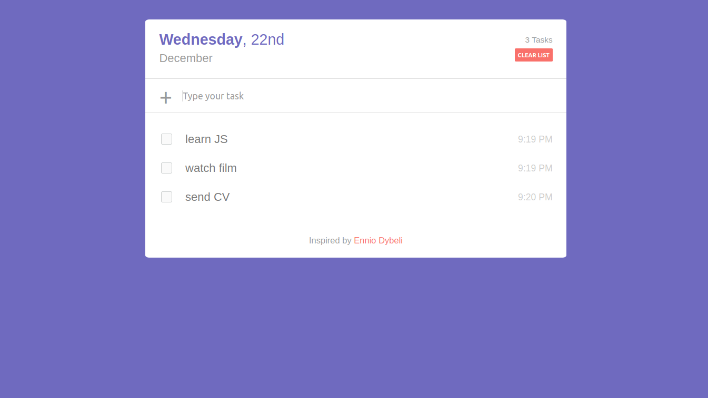

#### Short description

The project is a task scheduler where you are able to add new tasks, mark completed tasks and reset the list of tasks. 
Changes are saved when the browser is closed or the operating system is restarted. 
  
#### Application look

